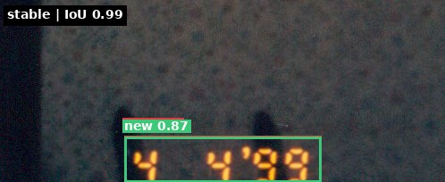
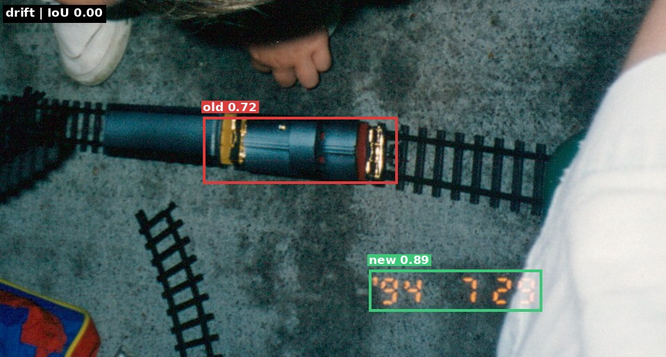
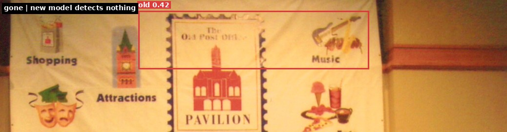

# YOLO Date Stamp Detector

Fine-tuned YOLOv8 model to detect camera date stamp regions on scanned photographs.

Many consumer cameras from the 1980s-2000s imprinted date stamps directly onto film --
small orange/red/amber LED digits (typically `M D 'YY`, e.g. "10 3 '99") burned into
the bottom edge of each photo. When these photos are later bulk-scanned, the date stamps
become the only reliable source of temporal metadata.

This project trains a single-class object detector to locate these stamp regions, enabling
downstream OCR to extract actual dates and write them back as EXIF metadata.

### Detection Example

| Input scan | Model output (conf 0.82) |
|:---:|:---:|
|  |  |

The model draws a bounding box around the orange "4 23 '95" date stamp in the bottom-right corner.

## Results

Trained on ~3,000 hand-labeled scanned photos, the current model achieves:

| Metric | Value |
|--------|-------|
| Precision | 95.9% |
| Recall | 96.1% |
| mAP@50 | 96.2% |
| mAP@50-95 | 75.4% |

The lower mAP@50-95 reflects some imprecision in tight bounding box localization,
which is acceptable since the box only needs to roughly locate the stamp region
for OCR cropping.

### Training runs

Two full training runs produced the numbers above:

1. **CPU run** -- earlier YOLOv8-nano run on a Ryzen 5 5600G, `imgsz=640`, `batch=4`,
   early-stopped at epoch 37/100. Wall time ~9 hours. Reached precision 95.3% /
   recall 95.8% / mAP@50 95.0%.
2. **GPU run (current)** -- YOLO26-medium, `imgsz=416`, `batch=16`, 40 epochs on an
   AWS `g4dn.xlarge` on-demand instance. Training wall time **33.55 min**
   (50.3 s/epoch), total cost **$0.35** including instance spin-up and data
   staging. The plots below come from this run.

### Drift vs. prior model

To confirm the GPU run was a clean upgrade, the new weights were re-run across the
same 6,458 scans the CPU model had already predicted on, and the two prediction sets
compared box-for-box via [scripts/infer/compare_predictions.py](scripts/infer/compare_predictions.py):

| Category | Count | Share |
|---|---|---|
| **stable** (IoU >= 0.5 with old box) | 6,229 | 96.5% |
| **drift** (IoU < 0.5, new box in a different place) | 197 | 3.0% |
| **gone** (new model finds nothing where old one did) | 32 | 0.5% |

Median IoU across the stable set was 0.92, and mean detection confidence jumped from
**0.70 to 0.85**. The number of predictions clearing `conf >= 0.7` went from 4,583 to
6,075 -- roughly 1,500 borderline cases got promoted into "obviously correct"
territory, shrinking the manual-review queue by a corresponding amount.

#### What those categories look like

The three examples below are cropped around the union of the old and new bounding
boxes. Red is the CPU-run prediction, green is the GPU-run prediction. The rest of
the family photo is cropped out for privacy.

**Stable (IoU 0.99):** both models agree to within a couple of pixels. The vast
majority of the dataset looks like this.



**Drift (IoU 0.00):** the old model confidently boxed a toy train across the lower
half of the frame; the new model ignored the toy and found the actual "'94 7 23"
stamp tucked into the corner.



**Gone:** the old model was fooled by a decorative "Old Post Office" postage-stamp
graphic painted on a mall banner and scored it at 0.42 confidence. The new model
produces no detection, which is the correct answer.



These three failure-mode recoveries -- confusing toys for stamps, and hallucinating
stamps on top of stamp-like graphics -- account for most of the ~230 drifted or
gone predictions.

### Precision-Recall Curve


The PR curve hugs the top-right corner with 0.962 mAP@0.5. Precision stays above 95%
across almost the entire recall range before dropping off past recall 0.97.

### F1-Confidence Curve


Peak F1 of 0.96 at confidence threshold 0.50. The broad plateau from 0.1 to 0.85
means the model is robust to threshold selection -- you don't need to fine-tune
the threshold to get good results.

### Confusion Matrix


On the 663-image validation split: 587 true positives, 17 stamps missed (recall
97.2%), and 40 background-only images where the model drew a spurious box. The
bulk of the residual error sits in that 40-image FP column; no-stamp photos added
as negative training examples keep the rate from being much worse.

### Confidence Distribution


Inference across 6,458 scans, same images both runs. Red bars are the CPU model's
confidence histogram; green bars are the GPU model's. The GPU run collapses the
entire distribution into a single dominant peak above 0.85 -- the secondary cluster
around 0.3 that was driving most of the manual-review work is gone.

## Approach

### Why YOLO?

Initial attempts used OpenCV heuristics (color filtering for orange digits, edge detection)
but these proved unreliable -- date stamps vary in color, brightness, position, and some
photos have orange-tinted content that triggers false positives. A learned detector
generalizes far better from labeled examples.

YOLO (You Only Look Once) is a family of object detection models that process an entire
image in a single forward pass, predicting bounding box locations and class labels
simultaneously. This project uses YOLO26-medium (~20M parameters) from
[Ultralytics](https://github.com/ultralytics/ultralytics). It starts from weights
pre-trained on the COCO dataset (330K images, 80 object classes), then fine-tunes on a
few thousand labeled date stamp examples. The CPU variant of the training runs on a
Ryzen 5 5600G in ~9 hours; a single `g4dn.xlarge` GPU finishes the same run in about
half an hour for roughly 35 cents.

### Pipeline

```
 Annotate          Train           Infer           Review          OCR
 (browser UI) --> (YOLO26m) --> (batch pred) --> (dashboard) --> (LLM/Tesseract)
      |               |              |               |               |
  human labels    fine-tune     predictions    corrections      date strings
  (bbox + skip)   on labels    (confidence)   (confirm/edit)   (EXIF-ready)
```

1. **Annotate** -- Browser-based labeling UI for drawing bounding boxes around date stamps. Keyboard-driven workflow (arrow keys to navigate, click-drag to draw). Skipped photos become negative training examples.

2. **Train** -- YOLO26-medium fine-tuned on labeled data. Automatic train/val split (80/20). Resumes from previous best weights if available. Early stopping prevents overfitting.

3. **Infer** -- Batch inference on all unlabeled photos. Low confidence threshold (0.01) to catch all candidates. Predictions saved as JSON for review.

4. **Review** -- Corrections dashboard for reviewing predictions. Supports confirm, edit bbox, mark as no-stamp, and skip. Bulk approve for high-confidence batches. Handles rotated photos.

5. **OCR** -- Crops detected stamp regions and sends to an LLM (Claude Haiku) or Tesseract for text extraction. Tracks token usage and cost.

The pipeline is iterative: corrections from step 4 feed back into training data for the next training round, improving the model over time.

## Setup

### Prerequisites

- Python 3.12+ via [uv](https://github.com/astral-sh/uv)
- [just](https://github.com/casey/just) task runner
- PostgreSQL (optional, for corrections dashboard rotation tracking)
- No GPU required (CPU training takes ~9 hours; a one-off GPU training run is
  scripted in [scripts/train/gpu_bench_one_epoch.py](scripts/train/gpu_bench_one_epoch.py)
  and costs about $0.35)

### Quick Start

```sh
git clone https://github.com/pike00/yolo-datestamp-detector.git
cd yolo-datestamp-detector

# uv handles dependencies automatically via inline PEP 723 script headers.
# No pip install or requirements.txt needed.

# Place scanned photo JPGs in scanmyphotos/ with naming: d{disc}_{number}.jpg
# Or use your own images -- any JPGs in scanmyphotos/ work for annotation.

# Start annotating
just annotate

# Train the model (after labeling some images)
just train

# Run batch inference
just infer

# Review predictions
just dashboard
```

### Data Setup

Source images go in `scanmyphotos/` (gitignored). The naming convention is
`d{disc}_{filename}.jpg` (e.g. `d1_00000133.jpg`), but any JPGs will work.

If you have a PostgreSQL database with file metadata, `setup_scanmyphotos.py` can
query it and copy images automatically. Configure via environment variables:

```sh
export ORIGINALS_DIR=/path/to/deduplicated/originals
export DB_HOST=localhost
export DB_PORT=5432
export DB_NAME=dedup
export DB_USER=dedup
export DB_PASSWORD=changeme
just setup-scanmyphotos
```

## Usage

```sh
just                    # List all commands
just annotate           # Label bounding boxes (browser UI, :8888)
just train              # Train model (resumes from best.pt)
just infer              # Batch inference on pending images
just cycle              # Train then infer
just dashboard          # Corrections dashboard (:8889)
just ocr                # OCR detected stamps (requires ANTHROPIC_API_KEY)
just stats              # Dataset statistics
just update-status      # Refresh state/status.json
just tensorboard        # Training metrics
just infer-one <photo>  # Single-image inference
```

## Project Structure

```
.
|-- scripts/
|   |-- train/                   # Model training + GPU benchmark + val-plot regen
|   |-- infer/                   # Batch inference + prediction drift analysis
|   |-- annotate/                # Annotation server, corrections dashboard, feedback loop
|   |-- ocr/                     # Haiku/Gemma/Ollama OCR + parallel orchestrator
|   `-- data/                    # Dataset prep: import, sampling, augmentation, rotation
|-- ui/
|   |-- index.html               # Browser annotation UI (vanilla JS + Canvas)
|   |-- dashboard.html           # Corrections dashboard UI
|   `-- batch_review.html        # Bulk review UI for high-confidence predictions
|-- state/                       # Runtime state files (gitignored, except skipped.txt)
|-- output/                      # Inference visualizations and previews (gitignored)
|-- docker/                      # Dockerfiles and compose configs
|-- dataset/
|   |-- data.yaml                # YOLO dataset config
|   |-- labels/                  # YOLO-format bounding box labels
|   |-- corrections/             # Corrected labels from feedback loop
|   `-- to_annotate/             # Staging area for correction annotation
|-- examples/                    # Sample photos and model evaluation plots
|-- scanmyphotos/                # Working image directory (gitignored)
`-- runs/                        # Training runs + model weights (gitignored)
```

## Model Details

| Parameter | Value |
|-----------|-------|
| Base model | YOLO26-medium (~20M params, ~68 GFLOPs) |
| Classes | 1 ("target" = date stamp region) |
| Training image size | 416px |
| Inference image size | 384px |
| Batch size | 16 |
| Epochs | 40 (no early stopping triggered) |
| Confidence threshold | 0.01 (batch inference), 0.50 (recommended operational) |

## Docker

```sh
docker compose -f docker/docker-compose.yml up cycle    # Train + infer in container
```

Mounts `dataset/`, `scanmyphotos/`, and `runs/` as volumes.

## License

MIT
