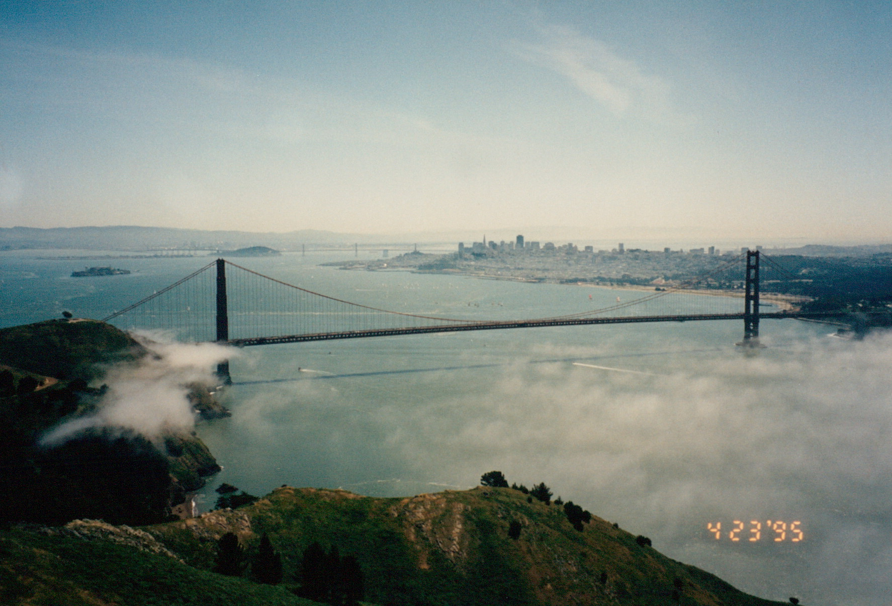
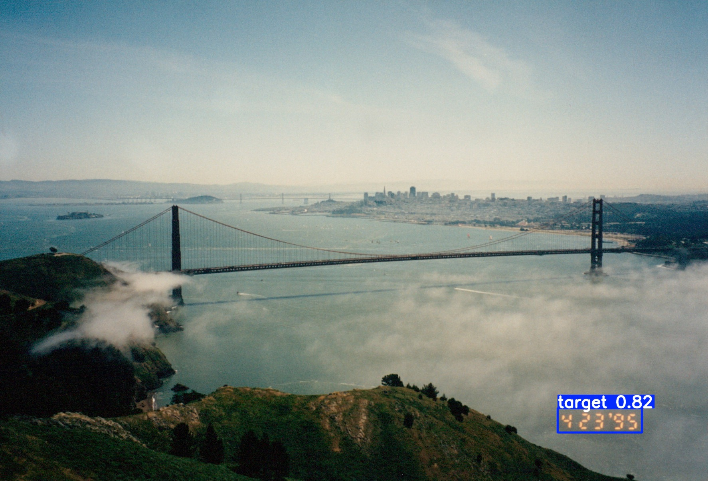
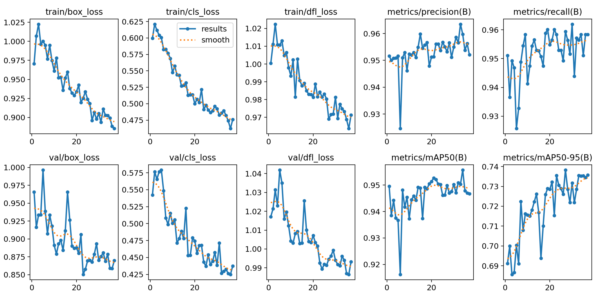
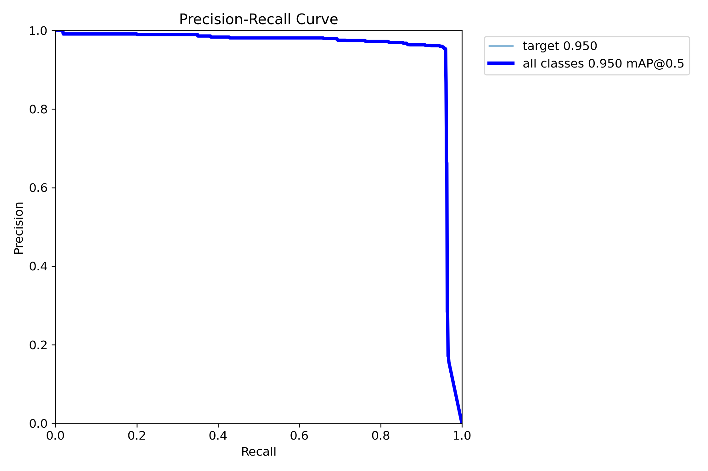
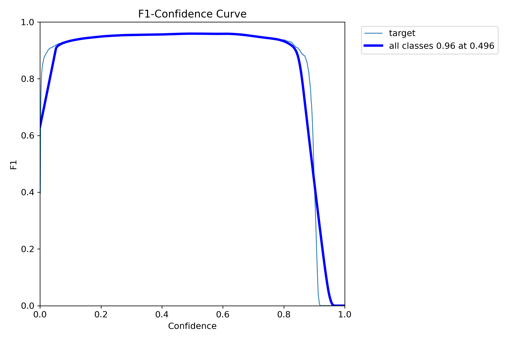
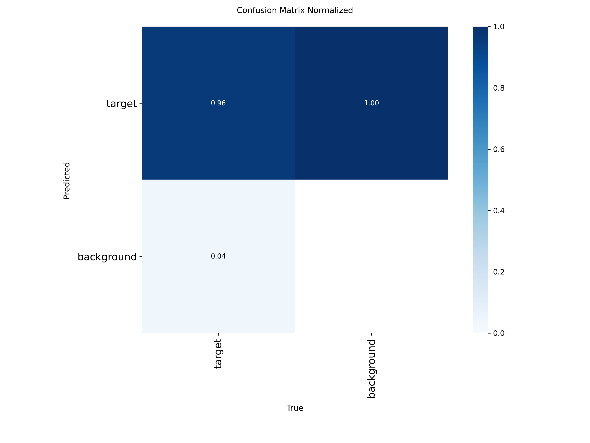
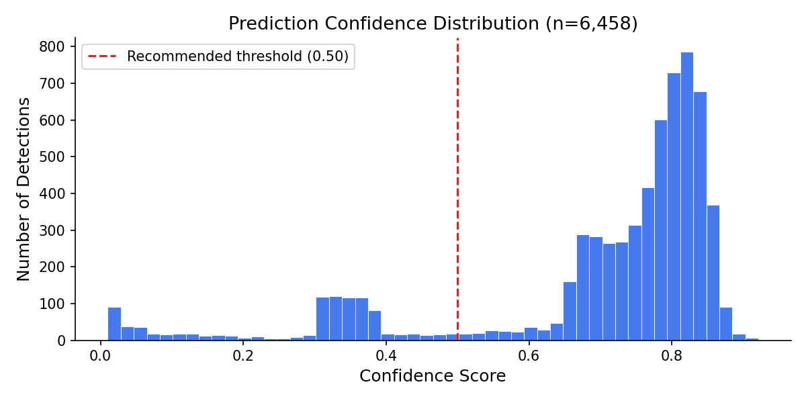

# YOLO Date Stamp Detector

Fine-tuned YOLOv8 model to detect camera date stamp regions on scanned photographs.

Many consumer cameras from the 1980s-2000s imprinted date stamps directly onto film --
small orange/red/amber LED digits (typically `M D 'YY`, e.g. "10 3 '99") burned into
the bottom edge of each photo. When these photos are later bulk-scanned, the date stamps
become the only reliable source of temporal metadata.

This project trains a single-class object detector to locate these stamp regions, enabling
downstream OCR to extract actual dates and write them back as EXIF metadata.

### Detection Example

| Input scan | Model output (conf 0.82) |
|:---:|:---:|
|  |  |

The model draws a bounding box around the orange "4 23 '95" date stamp in the bottom-right corner.

## Results

Trained on ~3,000 hand-labeled scanned photos, the model achieves:

| Metric | Value |
|--------|-------|
| Precision | 95.3% |
| Recall | 95.8% |
| mAP@50 | 95.0% |
| mAP@50-95 | 73.8% |
| F1 (optimal) | 0.96 @ conf 0.37 |

Training converged in 27 epochs (early-stopped at 37/100). The lower mAP@50-95 reflects
some imprecision in tight bounding box localization, which is acceptable since the box
only needs to roughly locate the stamp region for OCR cropping.

### Training Curves



All losses (box, classification, DFL) decrease smoothly across training and validation sets.
Precision, recall, and mAP metrics stabilize around epoch 20, confirming convergence without
overfitting.

### Precision-Recall Curve



The PR curve hugs the top-right corner with 0.950 mAP@0.5 -- near-perfect precision is
maintained across almost the entire recall range before dropping off at the very tail.

### F1-Confidence Curve



Peak F1 of 0.96 at confidence threshold 0.37. The broad plateau from 0.1-0.7 means the
model is robust to threshold selection -- you don't need to fine-tune the threshold to
get good results.

### Confusion Matrix



96% true positive rate with only 4% of stamps missed. Zero false positives on background
images -- the model never hallucinates a stamp where none exists.

### Confidence Distribution



Batch inference on ~7,500 images produced 6,458 detections. The bimodal distribution shows
a strong high-confidence peak (0.7-0.9, true positives) and a secondary cluster around
0.3-0.4 (borderline cases requiring manual review).

## Approach

### Why YOLO?

Initial attempts used OpenCV heuristics (color filtering for orange digits, edge detection)
but these proved unreliable -- date stamps vary in color, brightness, position, and some
photos have orange-tinted content that triggers false positives. A learned detector
generalizes far better from labeled examples.

YOLOv8-nano was chosen because:
- Single-class detection is a simple task; nano is sufficient
- All training runs on CPU (no GPU required)
- Fast inference (~50ms/image on CPU) enables batch processing thousands of photos

### Pipeline

```
 Annotate          Train           Infer           Review          OCR
 (browser UI) --> (YOLOv8n) --> (batch pred) --> (dashboard) --> (LLM/Tesseract)
      |               |              |               |               |
  human labels    fine-tune     predictions    corrections      date strings
  (bbox + skip)   on labels    (confidence)   (confirm/edit)   (EXIF-ready)
```

1. **Annotate** -- Browser-based labeling UI for drawing bounding boxes around date stamps. Keyboard-driven workflow (arrow keys to navigate, click-drag to draw). Skipped photos become negative training examples.

2. **Train** -- YOLOv8-nano fine-tuned on labeled data. Automatic train/val split (80/20). Resumes from previous best weights if available. Early stopping prevents overfitting.

3. **Infer** -- Batch inference on all unlabeled photos. Low confidence threshold (0.01) to catch all candidates. Predictions saved as JSON for review.

4. **Review** -- Corrections dashboard for reviewing predictions. Supports confirm, edit bbox, mark as no-stamp, and skip. Bulk approve for high-confidence batches. Handles rotated photos.

5. **OCR** -- Crops detected stamp regions and sends to an LLM (Claude Haiku) or Tesseract for text extraction. Tracks token usage and cost.

The pipeline is iterative: corrections from step 4 feed back into training data for the next training round, improving the model over time.

### Key Code

**Training** ([train.py](train.py)) -- dataset setup with automatic train/val split and YOLO fine-tuning:

```python
def train(data_yaml):
    best_pt = BASE_DIR / "runs" / "detect" / "train" / "weights" / "best.pt"
    if best_pt.exists():
        model = YOLO(str(best_pt))       # Resume from previous best
    else:
        model = YOLO("yolov8n.pt")       # Start from pretrained nano

    model.train(
        data=str(data_yaml),
        epochs=100, patience=10,          # Early stopping
        imgsz=640, batch=8, device="cpu",
        project=str(BASE_DIR / "runs" / "detect"),
        name="train", exist_ok=True,
    )
```

**Batch inference** ([infer_all.py](infer_all.py)) -- processes images in batches of 32 with progress tracking:

```python
def extract_best_prediction(result):
    """Extract best detection from a single result, or None."""
    if len(result.boxes) == 0:
        return None
    best_idx = result.boxes.conf.argmax()
    box = result.boxes[best_idx]
    x1, y1, x2, y2 = box.xyxy[0].tolist()
    img_h, img_w = result.orig_shape
    return {
        "x": round(((x1 + x2) / 2) / img_w, 6),
        "y": round(((y1 + y2) / 2) / img_h, 6),
        "w": round((x2 - x1) / img_w, 6),
        "h": round((y2 - y1) / img_h, 6),
        "confidence": round(float(box.conf[0]), 4),
    }
```

**OCR extraction** ([ocr_stamps.py](ocr_stamps.py)) -- crops detected region and sends to LLM for reading:

```python
def crop_stamp_region(img, pred):
    """Crop image to YOLO-predicted stamp region with padding."""
    w_img, h_img = img.size
    cx, cy = pred["x"] * w_img, pred["y"] * h_img
    bw, bh = pred["w"] * w_img, pred["h"] * h_img
    pad_x, pad_y = bw * PAD_FACTOR, bh * PAD_FACTOR
    return img.crop((
        max(0, int(cx - bw/2 - pad_x)),
        max(0, int(cy - bh/2 - pad_y)),
        min(w_img, int(cx + bw/2 + pad_x)),
        min(h_img, int(cy + bh/2 + pad_y)),
    ))
```

**Rotation handling** ([corrections_dashboard.py](corrections_dashboard.py)) -- transforms bounding boxes from rotated display space back to original image coordinates:

```python
def transform_bbox_to_original(cx, cy, w, h, rotation):
    """Transform bbox from rotated display space back to original image space."""
    if rotation == 0:    return cx, cy, w, h
    elif rotation == 90: return cy, 1 - cx, h, w       # 90 CW
    elif rotation == 180: return 1 - cx, 1 - cy, w, h
    elif rotation == 270: return 1 - cy, cx, h, w      # 270 CW
    return cx, cy, w, h
```

### Handling Rotation

Some scanned photos are rotated 90/180/270 degrees. The corrections dashboard supports
rotation during review, and bounding box coordinates are transformed back to the original
image coordinate space before saving labels. Rotation metadata is stored in PostgreSQL
for downstream processing.

## Setup

### Prerequisites

- Python 3.12+ via [uv](https://github.com/astral-sh/uv)
- [just](https://github.com/casey/just) task runner
- PostgreSQL (optional, for corrections dashboard rotation tracking)
- No GPU required

### Quick Start

```sh
git clone https://github.com/pike00/yolo-datestamp-detector.git
cd yolo-datestamp-detector

# uv handles dependencies automatically via inline PEP 723 script headers.
# No pip install or requirements.txt needed.

# Place scanned photo JPGs in scanmyphotos/ with naming: d{disc}_{number}.jpg
# Or use your own images -- any JPGs in scanmyphotos/ work for annotation.

# Start annotating
just annotate

# Train the model (after labeling some images)
just train

# Run batch inference
just infer

# Review predictions
just dashboard
```

### Data Setup

Source images go in `scanmyphotos/` (gitignored). The naming convention is
`d{disc}_{filename}.jpg` (e.g. `d1_00000133.jpg`), but any JPGs will work.

If you have a PostgreSQL database with file metadata, `setup_scanmyphotos.py` can
query it and copy images automatically. Configure via environment variables:

```sh
export ORIGINALS_DIR=/path/to/deduplicated/originals
export DB_HOST=localhost
export DB_PORT=5432
export DB_NAME=dedup
export DB_USER=dedup
export DB_PASSWORD=changeme
just setup-scanmyphotos
```

## Usage

```sh
just                    # List all commands
just annotate           # Label bounding boxes (browser UI, :8888)
just train              # Train model (resumes from best.pt)
just infer              # Batch inference on pending images
just cycle              # Train then infer
just dashboard          # Corrections dashboard (:8889)
just ocr                # OCR detected stamps (requires ANTHROPIC_API_KEY)
just stats              # Dataset statistics
just update-status      # Refresh status.json
just tensorboard        # Training metrics
just infer-one <photo>  # Single-image inference
```

## Project Structure

```
.
|-- annotate.py              # Annotation server + REST API
|-- index.html               # Browser annotation UI (vanilla JS + Canvas)
|-- train.py                 # YOLO fine-tuning with train/val split
|-- infer_all.py             # Batch inference with progress tracking
|-- corrections_dashboard.py # Prediction review/correction server
|-- dashboard.html           # Corrections dashboard UI
|-- batch_review.html        # Bulk review UI for high-confidence predictions
|-- feedback.py              # Feedback loop orchestration
|-- ocr_stamps.py            # Date stamp OCR via Claude Haiku
|-- setup_scanmyphotos.py    # Optional: import images from dedup database
|-- stratified_sample.py     # Stratified sampling across image sources
|-- dataset/
|   |-- data.yaml            # YOLO dataset config
|   |-- labels/              # YOLO-format bounding box labels
|   |-- corrections/         # Corrected labels from feedback loop
|   `-- to_annotate/         # Staging area for correction annotation
|-- examples/                # Sample photos and model evaluation plots
|-- scanmyphotos/            # Working image directory (gitignored)
|-- runs/                    # Training runs + model weights (gitignored)
`-- status.json              # Current project statistics
```

## Model Details

| Parameter | Value |
|-----------|-------|
| Base model | YOLOv8-nano (3M params, 8.2 GFLOPs) |
| Classes | 1 ("target" = date stamp region) |
| Training image size | 640px |
| Inference image size | 384px |
| Batch size | 8 |
| Early stopping | patience=10 |
| Confidence threshold | 0.01 (batch inference), 0.35 (recommended operational) |

## Docker

```sh
docker compose up cycle    # Train + infer in container
```

Mounts `dataset/`, `scanmyphotos/`, and `runs/` as volumes.

## License

MIT
